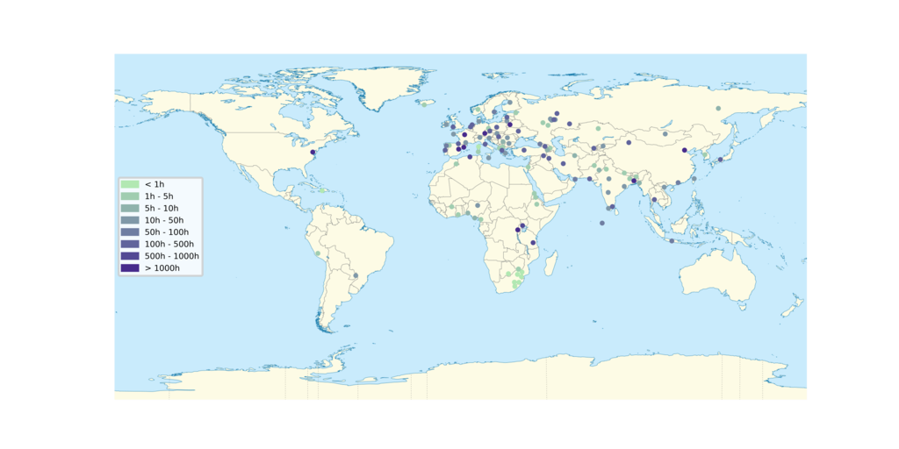

# commonvoice-map



## To generate a new map

* Download the latest stats
```
wget -q -O - "https://commonvoice.mozilla.org/api/v1/stats/languages" | json_pp > languages.json
```
* If there are two letter codes, update `iso2to3.py` with the mappings to three letter codes.
* Update `mapdata.tsv` by adding the mapping from code to latitude/longitude (you can get this from [Glottolog](https://glottolog.org/)).
* Run `plot.py`
